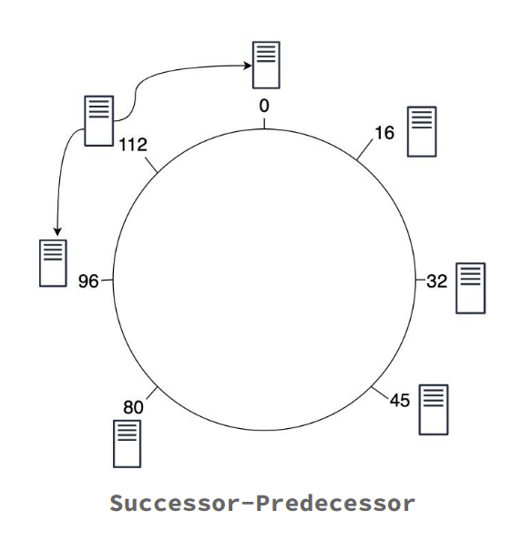

## Chord Protocol - A Distributed Hash Table
____________________

CHORD is a simple Peer to Peer protocol which implements a Distributed Hash Table detailed as per the paper - [Stoica, Ion, Robert Morris, David Karger, M. Frans Kaashoek, and Hari Balakrishnan. "Chord: A scalable peer-to-peer lookup service for internet applications." ACM SIGCOMM Computer Communication Review 31, no. 4 (2001): 149-160.](https://pdos.csail.mit.edu/papers/chord:sigcomm01/chord_sigcomm.pdf)

This project has two components, the Peer (`Node_DHT.py`) and the Client(`Client.py`).

### The Peer:

The Peer program defines a distributed network of nodes which are self aware of their postion in the CHORD architecture which is a ring. Each node of the CHORD architecture is aware of it's successor and predecessor.First of all any node joins the CHORD network simply by calculating an ID on the basis of it's ip and port number then any new node coming in the ring joins the ring by communicating with any of the node in the ring and finding the its successor and hence it's position in the ring.

There are two types of peer pointers
1. Successor - Predecessor
2. Finger table

#### Finger table
To avoid the linear search, Chord implements a faster search method by requiring each node to keep a finger table containing up to m entries, recall that m is the number of bits in the hash key. The ith entry of node n will contain a successor( ( n + 2i-1 ) mod m). The first entry of the finger table is actually the node's immediate successor (and therefore an extra successor field is not needed). Every time a node wants to look up a key k, it will pass the query to the closest successor or predecessor (depending on the finger table) of k in its finger table (the "largest" one on the circle whose ID is smaller than k), until a node finds out the key is stored in its immediate successor.

#### Node join

Chord needs to deal with nodes joining the system concurrently and with nodes that fail or leave voluntarily.
A basic ***stabilization*** protocol is used to keep nodes’ successor pointers up to date, which is sufficient to guarantee correctness of lookups. Those successor pointers are then used to verify and correct finger table entries, which allows these lookups to be fast as well as correct.
If joining nodes have affected some region of the Chord ring, a lookup that occurs before stabilization has finished can exhibit one of three behaviors.
1. The common case is that all the finger table entries involved in the lookup are reasonably current, and the lookup finds the correct successor in ***O(log N)*** steps.
2. The second case is where successor pointers are correct, but fingers are inaccurate. This yields correct lookups, but they may be slower. 
3. In the final case, the nodes in the affected region have incorrect successor pointers, or keys may not yet have migrated to newly joined nodes, and the lookup may fail.

Stabilization scheme guarantees to add nodes to a Chord ring in a way that preserves reachability of existing nodes, even in the face of concurrent joins and lost and reordered messages

#### Routing
Routing protocol for operations like insert, delete and search.
1. Hash the object to get a key k in range 0 to 2^m.
2. If(k is not in between predecessor(n) and n)
    - At node n, send query for key k to largest successor/finger entry <= k.
    - If none exist, send a query to successor(n).
3. Else
    - Process the query.

***Number of hops***: O(log(N)) Where ***N*** is number of Peers.

#### Stabilization
To support concurrent joins, we have implemented a stabilization module. It ensures correct lookups, all successor pointers must be up to date. Therefore, a stabilization protocol is running periodically in the background which updates finger tables and successor pointers.

The stabilization protocol works as follows:

1. ***Stabilize()***: n asks its successor for its predecessor p and decides whether p should be n‘s successor instead (this is the case if p recently joined the system).
2. ***Notify()***: notifies n‘s successor of its existence, so it can change its predecessor to n
3. ***Fix_fingers()***: updates finger tables periodically based on predefined rules.

### DHT Client:

The client program is used to connect to the CHORD network for storing, retreival and deletion of key-value pairs on the nodes.

## USAGE 
_________________

### The Peer:

*Usage:* 

1. For the first node joining the ring
`python3 Node_DHT.py port_number`
here port_number is the port at which the node will listen for requests.

2. For any forth coming nodes into the ring
`python3 Node_DHT.py <port number of new node> <port number of existing node>`
here "port number of new node" is the port at which the node will listen for requests and  "port number of existing node" is the port number of any of the other pre existing nodes in the ring.

### The Client:

*Usage:* `python3 Client.py`

The client is menu driven where we need to provide inputs like the port number of the node which the client wants to connect to and then the option according to the task the client wants to perform like insert, search, delete etc.

### test.sh:

*UsageL* `bash test.sh`
The test.sh script is used to test the working of the code 
The script spawns 3 different nodes and performs insert and search operations on those nodes.

Link to video for Chord explanation and code run : https://youtu.be/2rNEjQCpFCo
