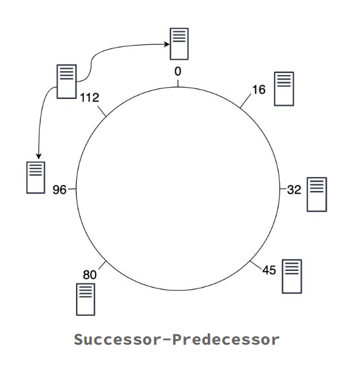
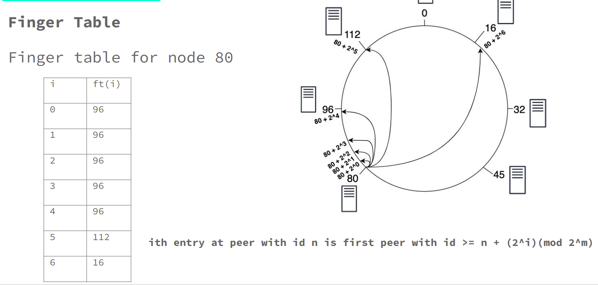

## Chord Protocol - A Distributed Hash Table
____________________

CHORD is a simple Peer to Peer protocol which implements a Distributed Hash Table detailed as per the paper - [Stoica, Ion, Robert Morris, David Karger, M. Frans Kaashoek, and Hari Balakrishnan. "Chord: A scalable peer-to-peer lookup service for internet applications." ACM SIGCOMM Computer Communication Review 31, no. 4 (2001): 149-160.](https://pdos.csail.mit.edu/papers/chord:sigcomm01/chord_sigcomm.pdf)

This project has two components, the Peer (`Node_vishal_2.py`) and the Client(`Client.py`).

### The Peer:

The Peer program defines a distributed network of nodes which are self aware of their postion in the CHORD architecture which is a ring. Each node of the CHORD architecture is aware of it's successor and predecessor.First of all any node joins the CHORD network simply by calculating an ID on the basis of it's ip and port number then any new node coming in the ring joins the ring by communicating with any of the node in the ring and finding the its successor and hence it's position in the ring.

There are two types of peer pointers
1. Successor - Predecessor
2. Finger table

#### Finger table
To avoid the linear search, Chord implements a faster search method by requiring each node to keep a finger table containing up to m entries, recall that m is the number of bits in the hash key. The ith entry of node n will contain a successor( ( n + 2i-1 ) mod m). The first entry of the finger table is actually the node's immediate successor (and therefore an extra successor field is not needed). Every time a node wants to look up a key k, it will pass the query to the closest successor or predecessor (depending on the finger table) of k in its finger table (the "largest" one on the circle whose ID is smaller than k), until a node finds out the key is stored in its immediate successor.

#### Node join

Whenever a new node joins, three invariants should be maintained (the first two ensure
correctness and the last one keeps querying fast):

- Each node's successor points to its immediate successor correctly.
- Each key is stored in successor(k)
- Each node's finger table should be correct.

To satisfy these invariants, a predecessor field is maintained for each node. As the
successor is the first entry of the finger table, we do not need to maintain this field separately
any more. The following tasks should be done for a newly joined node n:

1. Initialize node n (the predecessor and the finger table).
2. Notify other nodes to update their predecessors and finger tables.
3. The new node takes over its responsible keys from its successor.

The predecessor of ***n*** can be easily obtained from the predecessor of ***successor(n)*** (in the
previous circle). As for its finger table, there are various initialization methods. The simplest
one is to execute find successor queries for all m entries, resulting in ***O(M log N)*** initialization
time. A better method is to check whether i^th entry in the finger table is still correct for the
(i+1)^th entry. This will lead to O(log^2 N). The best method is to initialize the finger table
from its immediate neighbours and make some updates, which is ***O(log N) ***.

#### Routing
Routing protocol for operations like insert, delete and search.
1. Hash the object to get a key k in range 0 to 2^m.
2. If(k is not in between predecessor(n) and n)
    - At node n, send query for key k to largest successor/finger entry <= k.
    - If none exist, send a query to successor(n).
3. Else
    - Process the query.

***Number of hops***: O(log(N)) Where ***N*** is number of Peers.

#### Stabilization
To support concurrent joins, we have implemented a stabilization module. It ensures correct lookups, all successor pointers must be up to date. Therefore, a stabilization protocol is running periodically in the background which updates finger tables and successor pointers.

The stabilization protocol works as follows:

1. ***Stabilize()***: n asks its successor for its predecessor p and decides whether p should be n‘s successor instead (this is the case if p recently joined the system).
2. ***Notify()***: notifies n‘s successor of its existence, so it can change its predecessor to n
3. ***Fix_fingers()***: updates finger tables periodically based on predefined rules.

### DHT Client:

The client program is used to connect to the CHORD network for storing, retreival and deletion of key-value pairs on the nodes.

## USAGE & EXAMPLES
_________________

### The Peer:

*Usage:* 

For the first node joining the ring
`python3 Node_DHT.py port_number`
here port_number is the port at which the node will listen for requests.

For any forth coming nodes into the ring
`python3 Node_DHT.py <port number of new node> <port number of existing node>`
here "port number of new node" is the port at which the node will listen for requests and  "port number of existing node" is the port number of any of the other pre existing nodes in the ring.

### The Client:

*Usage:* `python3 Client.py`

The client is menu driven where we need to provide inputs like the port number of the node which the client wants to connect to and then the option according to the task the client wants to perform like insert, search, delete etc.
